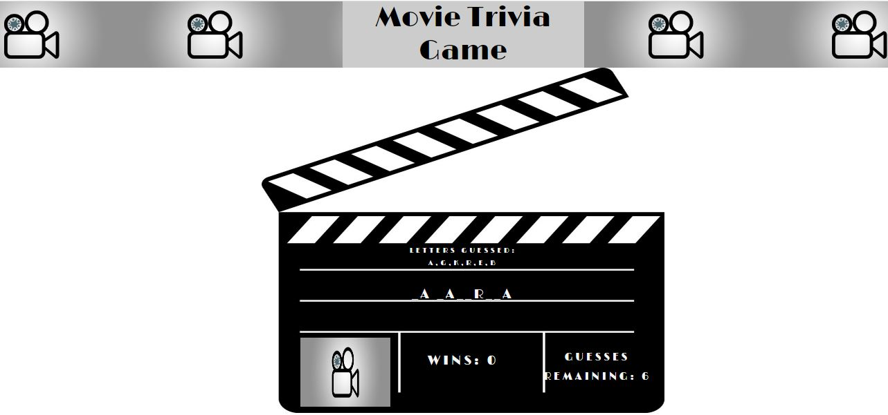
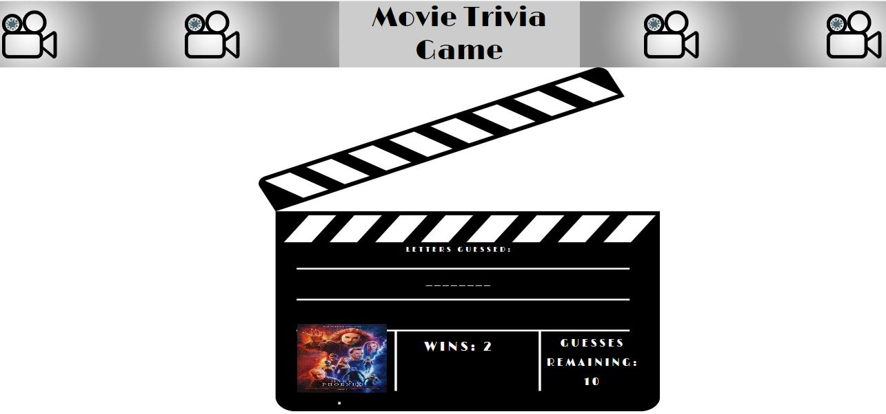

# Movie Trivia Game

## Overview 

App developed with Javascript that has a movie list and you will need to try to guess the name only with the number of positions displayed in the screen.
Every wrong letter will be added in the first section and every success letter will be discovered in the right position.
If a letter is selected two or more times it will not be counted.
When the movie name has been discovered a victory sound will be reproduced, otherwise the looser sound will be reproduces, for both cases the movie image will be displayed.

  
  

## Technologies used to develop the app
- HTML5
- CSS
- Bootstrap
- Javascript
- JQuery

## App Link
https://jfsilvah.github.io/Word-Guess-Game/index.html

## Author
ISC Francisco Silva
